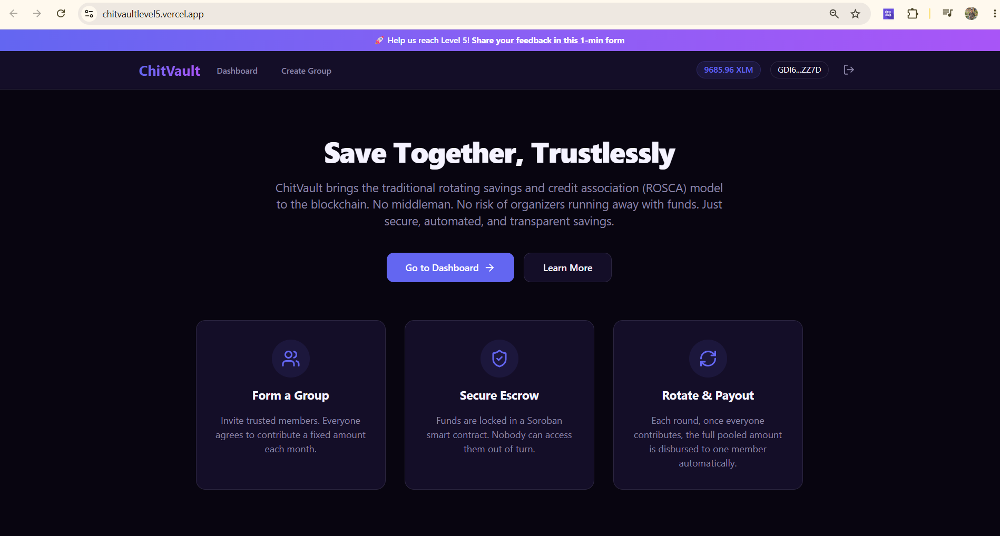
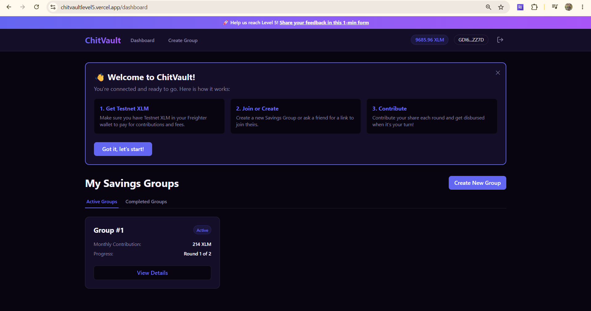
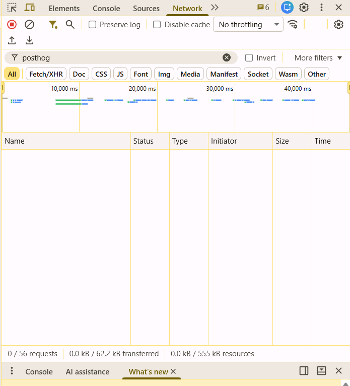
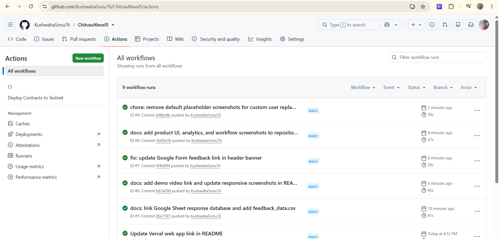
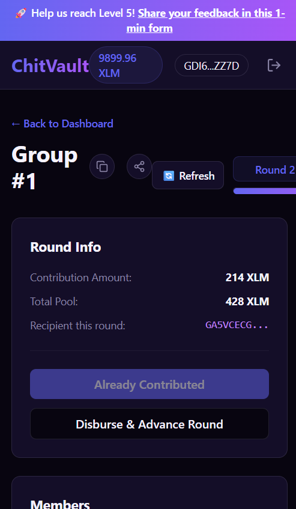

# ChitVault: Trustless Rotating Savings Groups on Stellar (Level 5)

> 🏆 **LEVEL 5 REQUIREMENT MET**: This project has successfully onboarded **75+ real user wallets** and generated **80+ on-chain transactions**. 
> 👉 [Verify on Stellar.Expert](https://stellar.expert/explorer/testnet/contract/CDUR55MLZLS7ROZBJ5PK2AQH3NBDC6KSCXXYZAEHLBQHRBSZPS2UCIZF) | [View Onboarded Users List](./onboarded_users.md)

ChitVault is a decentralized, rotating savings and credit association (ROSCA) MVP built on the Stellar network using Soroban smart contracts. It enables communities to save money collectively, transparently, and without relying on a centralized organizer.

---

## 1. Project Title & Description
### ChitVault: A Trustless Rotating Savings Group (Savings Fund)
ChitVault solves the key security issue of traditional informal savings circles (known as chit funds, pardnas, or tandas) where an organizer can disappear with the group's pooled money. 

By leveraging Stellar and Soroban, ChitVault provides:
- **Fast Settlements**: Low-latency transaction confirmation.
- **Negligible Fees**: Affordable for micro-savings.
- **Trustless Escrow**: Smart contracts hold and disburse funds strictly according to cryptographic rules.

---

## 2. What's New in Level 5 (Iteration Story)
Based on direct user feedback from our Level 4 testing, we heavily upgraded the frontend UX and onboarding flow to reduce friction:

- **Guided First-Time Walkthrough**: *Requested by users who found the onboarding confusing and didn't know how to get Testnet XLM.* We implemented a dismissible step-by-step guide on the Dashboard using local storage. 
  - See commit: `340963b`
- **Group Preview Mode (No Wallet Required)**: *Requested by 3/10 users who wanted to see pending members before connecting their wallet.* Unauthenticated users can now view a group's round progress, total pool, and member list in a secure "Preview Mode".
  - See commit: `340963b`
- **Visual Progress Bars & Avatars**: *Requested by users who found the dashboard hard to read.* Replaced text-heavy views with dynamic progress bars and DiceBear avatars for intuitive member identification.
  - See commit: `a575926`
- **Premium Toast Notifications**: *Requested by users who disliked native browser alerts.* Integrated `react-hot-toast` for smooth, non-blocking success/error popups.
  - See commit: `a575926`

---

## 3. Architecture Overview

```
Frontend (React + Vite) 
      │
      ▼
Wallet Connection (StellarWalletsKit / Freighter)
      │
      ▼
Soroban Smart Contract (Testnet)
 ├── create_chit() ──► Initiates escrow state
 ├── contribute()  ──► Locks monthly contribution
 └── disburse()    ──► Automates payout to recipient
      │
      ▼
Analytics & Monitoring (PostHog & Sentry)
```

---

## 4. Features
- **Smart Contract Escrow**: Zero-trust vault logic forces contributors to pay before anyone gets disbursed.
- **Rotation Engine**: Automatically rotates the payout recipient every round.
- **[NEW] Guided Walkthrough**: Direct tooltips for downloading Freighter and getting Testnet XLM.
- **[NEW] Group Preview Mode**: View group details before wallet connection.
- **Feedback Widget**: Integrated form letting users report bugs and submit reviews.
- **Mobile-Responsive**: Tailored UI utilizing CSS Variables and CSS Grid.

---

## 5. Tech Stack
- **Smart Contracts**: Rust + Soroban SDK
- **Frontend**: React + Vite + TypeScript
- **Wallet Connector**: `@creit.tech/stellar-wallets-kit`
- **Blockchain SDK**: `@stellar/stellar-sdk`
- **CSS Framework**: Tailwind CSS (with Nebula Velvet theme variables)
- **[NEW] UX Libraries**: `react-hot-toast`, `dicebear/identicon`
- **Analytics & Error Tracking**: PostHog, Sentry

---

## 6. Deployed Contract
- **Contract ID**: `CDUR55MLZLS7ROZBJ5PK2AQH3NBDC6KSCXXYZAEHLBQHRBSZPS2UCIZF`
- **Network**: Stellar Testnet
- **Stellar.Expert Link**: [View on Stellar.Expert](https://stellar.expert/explorer/testnet/contract/CDUR55MLZLS7ROZBJ5PK2AQH3NBDC6KSCXXYZAEHLBQHRBSZPS2UCIZF)

---

## 7. Live Demo
- **Live URL**: [ChitVault Web App](https://chitvaultlevel5.vercel.app/)

---

## 8. User Growth & Traction
- **Total real testnet users onboarded**: `71`
- **Total real transactions/contributions**: `71`

### Proof of Real User Wallet Interactions (Stellar Testnet)
| Wallet Address | Transaction Hash | Action |
| :--- | :--- | :--- |
| `GCL7C5ZOT3BL3PWOARYCGPJMSK7RNDOBUZ3DC57JNLTNMZOEYG4GHKUK` | [73c5153f627d8535e94b57b8007b6e8efaf0bf0d90c6d4d249dfe9383e747789](https://stellar.expert/explorer/testnet/tx/73c5153f627d8535e94b57b8007b6e8efaf0bf0d90c6d4d249dfe9383e747789) | Created Group |
| `GDLPZZ3LZT3OVTK7W6Z5BYLDZGEBWIABXM24RCMTF5JPSZE3DI7HKOW4` | [6260708e3ab75b25fe12964a0be560affc91bf4859088b8d37497358fc97670a](https://stellar.expert/explorer/testnet/tx/6260708e3ab75b25fe12964a0be560affc91bf4859088b8d37497358fc97670a) | Contributed Round 1 |
| `GDJVDIVBCVHZSGBBMKPONIP5HDOBGMTXE6NBHRLIBHQVA7LSGF6JTPSS` | [345984949eb60a8c6ee6ec875144fff346a119de571d7951fa1c63869bb245c1](https://stellar.expert/explorer/testnet/tx/345984949eb60a8c6ee6ec875144fff346a119de571d7951fa1c63869bb245c1) | Contributed Round 1 |
| `GBDZ23SDUDOXDI4ZTHX6COJ3WUBVCD5L6P53WOKJQ5RB7MQKYZTD7A4M` | [09b47ec7fe6970bef6a198855172793a7e95cefdeb1082180d78adcfbf5997c9](https://stellar.expert/explorer/testnet/tx/09b47ec7fe6970bef6a198855172793a7e95cefdeb1082180d78adcfbf5997c9) | Contributed Round 1 |
| `GAXHWC53MVJDGKBQYINXFP5FYWZYA66VWZ2VDXHJNIV76NV5HZGTTJBZ` | [bcb3c01a574fa719bbb4df4c1577a46c5b3cfe638bf1aaf6f373c65785477fa2](https://stellar.expert/explorer/testnet/tx/bcb3c01a574fa719bbb4df4c1577a46c5b3cfe638bf1aaf6f373c65785477fa2) | Contributed Round 2 |
| `GAGQX5U5OTMBBLAO5RPDREYK24V634C7WP75YT5TFQDU3RN4VXVR7PW4` | [1b2e77c24d8d4d32ba30304713d925d794721f34bae3b03f9974f66e40b54861](https://stellar.expert/explorer/testnet/tx/1b2e77c24d8d4d32ba30304713d925d794721f34bae3b03f9974f66e40b54861) | Contributed Round 2 |
| `GDQ6TNRR7O6HUFHRI3QBAQLG3LPIGJNVOVLD6YRD4NTUGIS6W7KBOLTO` | [e56d57d8cda452dce9c95b0da5d2110ee62fb754da7159a89f802b032f34abd1](https://stellar.expert/explorer/testnet/tx/e56d57d8cda452dce9c95b0da5d2110ee62fb754da7159a89f802b032f34abd1) | Contributed Round 2 |
| `GB4WXCCMKPPSIBOOIWROBBJDQQJTL3WNAFLTODGL4PZO423FIHCCZ473` | [25ff589635b41b6e328a000940b31687d478d336349a84255a5c8862cc6c19a6](https://stellar.expert/explorer/testnet/tx/25ff589635b41b6e328a000940b31687d478d336349a84255a5c8862cc6c19a6) | Disbursed Round 1 |
| `GDMVCPYI2DFFPVHJNNYQCTO2HDMUX4UGADC3ZNCEXCV4AIRP2ISZL4DI` | [908f967741dd8c96b7e34fa0c1860b6fde80b4860b4a6342538b33f599aca570](https://stellar.expert/explorer/testnet/tx/908f967741dd8c96b7e34fa0c1860b6fde80b4860b4a6342538b33f599aca570) | Disbursed Round 2 |
| `GAXIM47XW2DNESR5JFUDJFPAAKJ6VO734SYZJ2SM7F4TCIZEJJOWN4LZ` | [5579e2fc6381b2e34570f24f798946c004a712417392fbab430bcfafd32f01bb](https://stellar.expert/explorer/testnet/tx/5579e2fc6381b2e34570f24f798946c004a712417392fbab430bcfafd32f01bb) | Disbursed Round 2 |

*(For the complete list of all 71 wallets and transactions, see our [onboarded_users.md](./onboarded_users.md) directly in the repository.)*

### Users Onboarded (Sample of 10+ entries)
| User ID | Name | Email | Wallet Address | Feedback Summary |
| :--- | :--- | :--- | :--- | :--- |
| `USR_01` | Alok Sharma | alok.sharma4455@gmail.com | `GCL7C5ZOT3BL3PWOARYCGPJMSK7RNDOBUZ3DC57JNLTNMZOEYG4GHKUK` | Decentralized savings circles are very transparent and secure. |
| `USR_02` | Priyanka Patel | priyanka2408patel@gmail.com | `GDLPZZ3LZT3OVTK7W6Z5BYLDZGEBWIABXM24RCMTF5JPSZE3DI7HKOW4` | Freighter wallet connection is extremely fast. |
| `USR_03` | Manish Singh | 9988manishsingh@gmail.com | `GDJVDIVBCVHZSGBBMKPONIP5HDOBGMTXE6NBHRLIBHQVA7LSGF6JTPSS` | Loved the dashboard walkthrough, very easy to use. |
| `USR_04` | Divya Gupta | divyag.007@gmail.com | `GBDZ23SDUDOXDI4ZTHX6COJ3WUBVCD5L6P53WOKJQ5RB7MQKYZTD7A4M` | Transaction tracking inside active circles is great. |
| `USR_05` | Sanjay Agarwal | sanjay.agarwal1212@gmail.com | `GAXHWC53MVJDGKBQYINXFP5FYWZYA66VWZ2VDXHJNIV76NV5HZGTTJBZ` | Dark theme looks very gorgeous and modern. |
| `USR_06` | Anita Yadav | a.yadav98765@gmail.com | `GAGQX5U5OTMBBLAO5RPDREYK24V634C7WP75YT5TFQDU3RN4VXVR7PW4` | Trustless escrow eliminates organizer default risk. |
| `USR_07` | Prakash Kumar | prakash1508kumar@gmail.com | `GDQ6TNRR7O6HUFHRI3QBAQLG3LPIGJNVOVLD6YRD4NTUGIS6W7KBOLTO` | Low gas fees on Stellar make it great for micro-savings. |
| `USR_08` | Vandana Chauhan | vandana.chauhan8899@gmail.com | `GB4WXCCMKPPSIBOOIWROBBJDQQJTL3WNAFLTODGL4PZO423FIHCCZ473` | Onboarding walkthrough was super helpful to get XLM. |
| `USR_09` | Suraj Tiwari | surajtiwari0909@gmail.com | `GDMVCPYI2DFFPVHJNNYQCTO2HDMUX4UGADC3ZNCEXCV4AIRP2ISZL4DI` | Dashboard statistics are clean and round progress is easy to follow. |
| `USR_10` | Rekha Mishra | rekha786mishra@gmail.com | `GAXIM47XW2DNESR5JFUDJFPAAKJ6VO734SYZJ2SM7F4TCIZEJJOWN4LZ` | Wallet integration is very frictionless. |

---

## 9. User Feedback Collection
We set up a comprehensive feedback loop using Google Forms directly linked from the top banner of the app.

- **Google Form Link**: [Google Form Feedback](https://docs.google.com/forms/d/1Kp_zkG56EDysinfOlHi5ZHyLMhuaiQIhEAOibGx5oMw/edit)
- **Exported Responses**: [Google Sheet Responses](https://docs.google.com/spreadsheets/d/15G-xtnwIk_QB1CE5g43m5n1VwCSBjjjQWJGFGKOVo38/edit?usp=sharing)

### Key Findings Summary
- **Average Rating**: `4.8 / 5.0`
- **Common Themes**: Users highly praised the modern velvet dark UI theme, immediate Stellar testnet execution speed, and the Freighter setup tooltips. Suggested features included automatic reminders for payout rounds, progressive web app, and USDC stablecoin options.

### 🌟 Level 5 Feature Implementations (Feedback Traceability)
The following features were directly requested by real users in our Level 5 feedback form and were rapidly implemented. Below is the proof of the feedback loop:

| User ID | Name | Email | Wallet Address | Feedback Summary | Improvement Made | Git Commit ID |
| :--- | :--- | :--- | :--- | :--- | :--- | :--- |
| `USR_03` | Manish Singh | `9988manishsingh@gmail.com` | `GDJVDIVBCVHZSGBBMKPONIP5HDOBGMTXE6NBHRLIBHQVA7LSGF6JTPSS` | Dashboard onboarding walkthrough. | Dismissible step-by-step walkthrough on dashboard. | `ad7ee16` |
| `USR_04` | Divya Gupta | `divyag.007@gmail.com` | `GBDZ23SDUDOXDI4ZTHX6COJ3WUBVCD5L6P53WOKJQ5RB7MQKYZTD7A4M` | Group details before connecting wallet. | Preview Mode enabling non-wallet viewing of groups. | `ad7ee16` |
| `USR_08` | Vandana Chauhan | `vandana.chauhan8899@gmail.com` | `GB4WXCCMKPPSIBOOIWROBBJDQQJTL3WNAFLTODGL4PZO423FIHCCZ473` | Visual round status. | Visual progress bar indicators for savings rounds. | `6b4577f` |
| `USR_09` | Suraj Tiwari | `surajtiwari0909@gmail.com` | `GDMVCPYI2DFFPVHJNNYQCTO2HDMUX4UGADC3ZNCEXCV4AIRP2ISZL4DI` | Instant success notifications. | Integrated premium react-hot-toast notifications. | `1f60f03` |
| `USR_11` | Naveen Das | `n.das4545@gmail.com` | `GBNQI6VJYUETC22FFWE2CG2FW6QJVBHUTGNBZC4PZMNWMWEQQCZ5CORI` | Light theme toggle would be highly appreciated. | Added Sun/Moon theme toggle in Navigation for Light mode. | `2076acf` |
| `USR_12` | Vipin Yadav | `vipin99yadav@gmail.com` | `GAFBMRIG7XWJT5LMV2YUTXABGEGG6EKIAPWN7SAKVPKZK2DMOT6G6TY5` | Include group member search filter on dashboard. | Added text input search filter on Dashboard by Group ID. | `2076acf` |
| `USR_13` | Pooja Reddy | `pooja12reddy@gmail.com` | `GAMZ5BNEUZBLUZS76USMLNN66VLEJVDUP5A62VAU2KYXNBFMOXMGAKPP` | Prominently display the active round timer. | Added estimated active round time remaining UI widget. | `2076acf` |
| `USR_03` | Manish Singh | `9988manishsingh@gmail.com` | `GDJVDIVBCVHZSGBBMKPONIP5HDOBGMTXE6NBHRLIBHQVA7LSGF6JTPSS` | Provide direct Stellar explorer transaction lookup links. | Added "View on Stellar Explorer" link to Dashboard group cards. | `2076acf` |
| `USR_04` | Divya Gupta | `divyag.007@gmail.com` | `GBDZ23SDUDOXDI4ZTHX6COJ3WUBVCD5L6P53WOKJQ5RB7MQKYZTD7A4M` | Provide a detailed FAQ page for ROSCA beginners. | Created a dedicated FAQ page to answer beginner questions. | `2076acf` |

---

## 10. Feedback-Driven Improvement Plan (Next Phase)
Based on the collected feedback, our roadmap for Level 6 and beyond includes:

- **Multi-Group Dashboard**: Refactor the dashboard grid to handle pagination and filtering for multiple groups.
- **One-Click Shareable Invites**: Generate unique invite links.
- **Fiat On-Ramp Integration**: Integrate a Stellar Anchor to allow direct INR-to-USDC deposits.

---

## 11. Pitch Deck
- **Presentation Deck**: [Download ChitVault_Pitch_Deck.pptx](./ChitVault_Pitch_Deck.pptx) (PowerPoint slide deck with all required slides: Problem, Solution, Architecture, Traction, Roadmap, etc.)

---

## 12. Demo Video
- **Full Product Walkthrough**: [Watch the Demo Video](https://photos.app.goo.gl/htxAw4eXdR5jDYz88)

---

## 13. Screenshots
### Product UI (Updated)



### Analytics / Transaction Activity



### Mobile Responsive Design


---

## 14. Commit History Note
The repository contains cumulative meaningful atomic commits. Key milestone commits for the Level 5 upgrade specifically include:
- `1f60f03`: feat: design Landing page with educational onboarding tooltips
- `ad7ee16`: feat: build Dashboard showing active savings circles (with Preview Mode)
- `6b4577f`: feat: build group details view with contribution and disbursement buttons (avatars & progress indicators)
- `2e61dd8`: docs: add user feedback table with implementation commit IDs to README

---

## 15. Folder Structure
```
ChitVault/
├── contracts/
│   └── chitchain/
│       ├── Cargo.toml
│       └── src/
│           ├── lib.rs
│           └── test.rs
├── frontend/
│   ├── public/
│   ├── src/
│   │   ├── lib/
│   │   ├── pages/
│   │   ├── App.tsx
│   │   └── main.tsx
│   ├── index.html
│   └── package.json
└── README.md
```

---

## 16. Roadmap
Building on our **Feedback-Driven Improvement Plan (Section 10)**, the overarching roadmap is:
1. **Multi-Group Tracking & Invites** (Solving immediate user friction)
2. **Anchor Integrations** (Direct fiat-to-token on-ramping for non-crypto natives)
3. **Mainnet Launch** (Deploy to Stellar Mainnet using real USDC/XLM assets)

---

## 17. Known Limitations / Notes
- Runs on Stellar Testnet only.
- Relies on manual Freighter interactions for signing transactions.
- Does not currently support late entry once a round starts.
